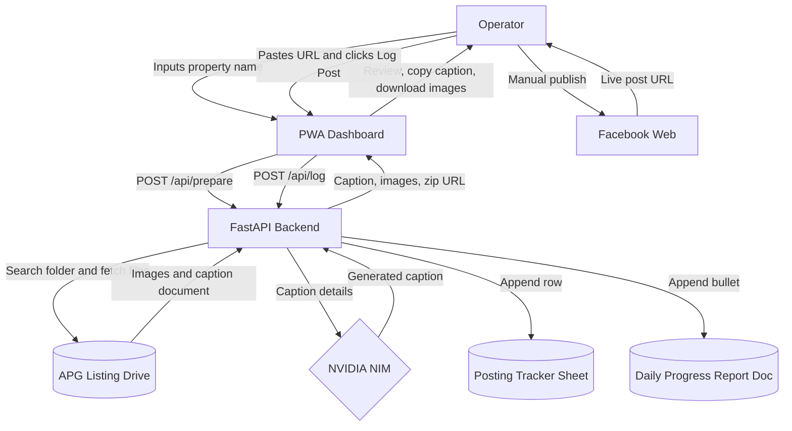

# APG Posting Desk - Human-In-The-Loop Flow



## Backend Routes

### `POST /api/prepare`

Request:

```json
{
  "property_name": "Novaliches, 440 Bagbag"
}
```

Response:

```json
{
  "preparation_id": "generated-id",
  "property_name": "Novaliches, 440 Bagbag",
  "caption": "Generated APG-safe caption",
  "caption_details": "Raw extracted caption details",
  "images": [
    { "name": "2.png", "url": "/prepared/generated-id/2.png" }
  ],
  "download_zip_url": "/api/preparations/generated-id/images.zip",
  "requires_manual_review": false,
  "violations": []
}
```

### `POST /api/log`

Request:

```json
{
  "property_name": "Novaliches, 440 Bagbag",
  "facebook_url": "https://facebook.com/live-post-url"
}
```

Response:

```json
{
  "status": "logged"
}
```

## Removed Integration

The project no longer posts through Facebook Graph API. Operators publish in
Facebook Web, then the app logs the resulting URL.
